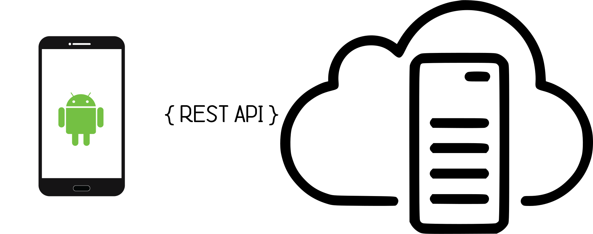

# AndroidRestfulAPI

## Context

Android REST client example using retrofit for API calls. It Used to make HTTP calls and parses the response in java objects instead of the manual parsing JSON response.

Here I just add the project where create the API call to access data from the database using the retrofit library; which is a leading library to access data on the network. 

The example shows how to google gson and retrofit can automatically support asynchronous requests using the retrofit Callback<T> interface, automatic serialization/deserialization to JSON with a GSON adapter.

## Resources

 * Retrofit - REST webservices.
   http://square.github.io/retrofit/
   
 * Google GSON - Serialization/Deserialization of service responses.
   https://github.com/google/gson
   
 * OkHttp - logging-interceptor.
   https://github.com/square/okhttp
 

